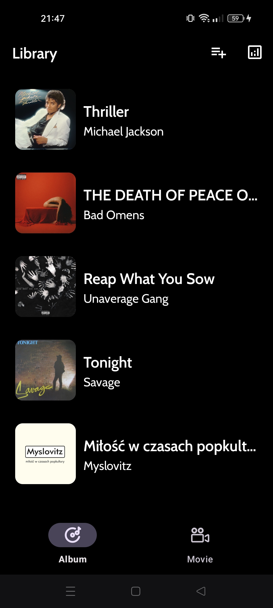
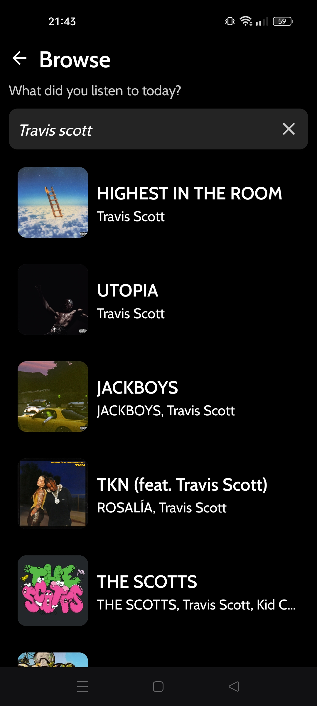
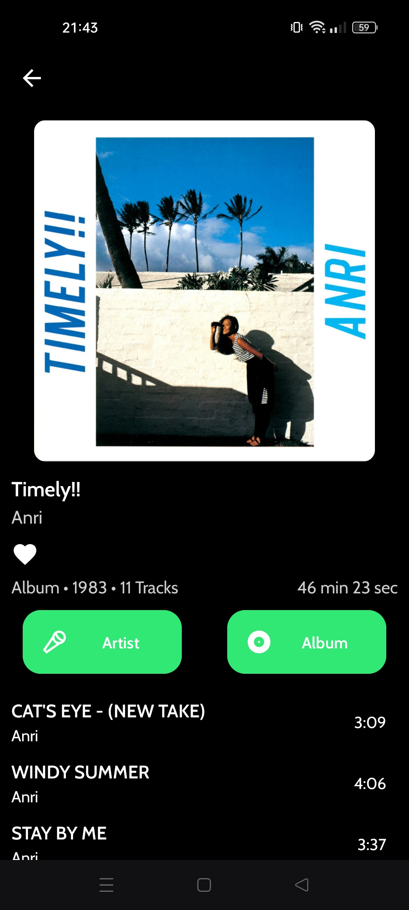
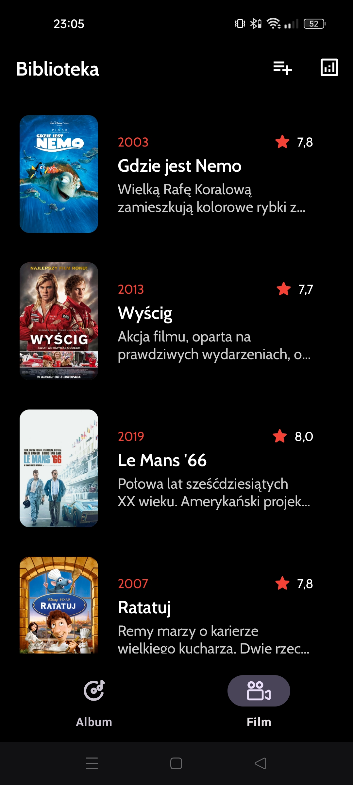
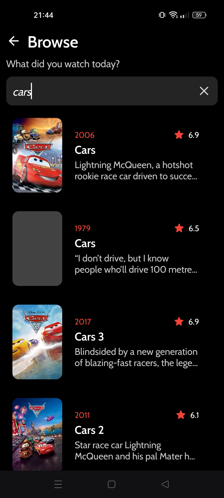
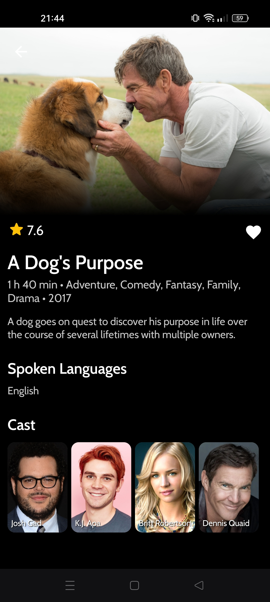

# Vuey


Vuey is open source Album & Movies tracker. Users can easily add their favorite albums and movies or save them for later. The application uses data from [Spotify](https://open.spotify.com/) and [TMDB](https://www.themoviedb.org/), so you can easily add your favorite albums and movies, track the time you've spent listening and watching, monitor how many albums and movies you have in your collection, as well as how many songs you've managed to listen to.

## Screenshots

| Album List | Album Search | Album Detail |
|:---:|:---:|:---:|
|  |  |  |

| Movie List | Movie Search | Movie Detail |
|:---:|:---:|:---:|
|  |  |  |

## Project Setup

1. Clone repository and open project in the latest version of Android Studio.
2. Generate and import your `google-services.json` file and put it in the `/app`
3. Create `local.properties` and import it to `/app`
4. Add your [Spotify](https://developer.spotify.com/) SPOTIFY_CLIENT_ID, SPOTIFY_CLIENT_SECRET and [TMDB](https://developer.themoviedb.org/docs) key in `local.properties`
```
TMDB_API_KEY="YOUR_TMDB_API_KEY"
SPOTIFY_CLIENT_ID="YOUR_SPOTIFY_CLIENT_ID"
SPOTIFY_CLIENT_SECRET="YOUR_SPOTIFY_CLIENT_SECRET"
```
5. Clean and rebuild project

## TODO
- [X] Improve UX/UI
- [X] Statistic Screen
- [X] Light/Night Mode
- [ ] Save data in the cloud

## Libraries
- [Retrofit](https://square.github.io/retrofit/)
- [Kotlin Coroutines](https://github.com/Kotlin/kotlinx.coroutines)
- [Dagger-Hilt](https://developer.android.com/training/dependency-injection/hilt-android)
- [OkHttpClient](https://square.github.io/okhttp/4.x/okhttp/okhttp3/-ok-http-client/)
- [Firebase](https://firebase.google.com/)
- [Room Database](https://developer.android.com/training/data-storage/room)
- [Gson](https://github.com/google/gson)
- [Coil](https://coil-kt.github.io/coil/)
- [Jetpack Compose](https://developer.android.com/jetpack/compose?gclid=Cj0KCQjw_5unBhCMARIsACZyzS0SxKgOdVQUqYghH9-q0Pi0kceSc9fTKpHZlxiailjbD8rmqtfJvgUaAnypEALw_wcB&gclsrc=aw.ds)

## Resources
- [Fonts](https://fonts.google.com/specimen/Cabin?query=cabin)
- [Icons](https://www.svgrepo.com/)
