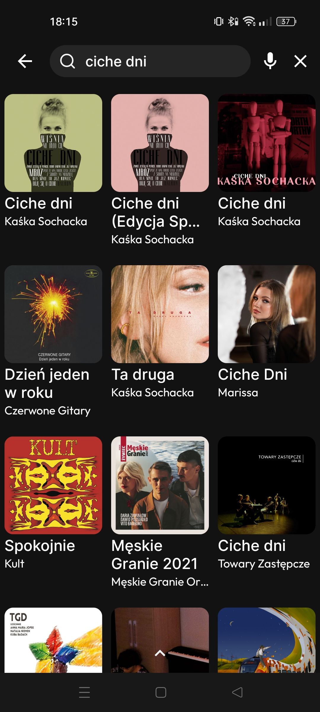
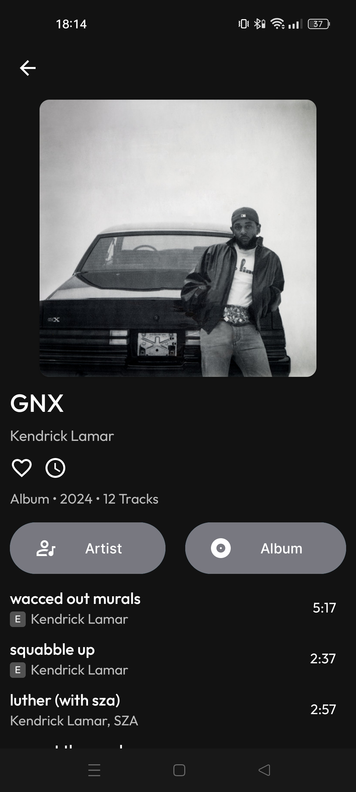

Valfi 🎧 is a **music discovery** and **album management** app 📱 that allows users to search 🔍 for their favorite albums, save them for easy access 💾, discover new releases 🎶, 
and stay updated with the latest music news 📰 from top sources 🌍.  
The app integrates with **Spotify** 🎵 to enhance music recommendations 🎧 and news feed, providing a comprehensive music experience 🎤.

## Screenshots
|    |               |
|:----------------------------------:|:---------------------------------------:|
|  |       |
|   |  |

## Project Setup
1. Clone repository and open project in the latest version of Android Studio.
2. Generate and import your `google-services.json` file and put it in the `/app`
3. Create `local.properties` and import it to `/app`
4. Add your [Spotify](https://developer.spotify.com/) SPOTIFY_CLIENT_ID, SPOTIFY_CLIENT_SECRET and [NewsApi](https://newsapi.org/) NEWS_API_KEY key in `local.properties`
```
SPOTIFY_CLIENT_ID = "YOUR_SPOTIFY_CLIENT_ID"
SPOTIFY_CLIENT_SECRET = "YOUR_SPOTIFY_CLIENT_SECRET"
NEWS_API_KEY = "YOUR_NEWS_API_KEY"
```

1. Create `keystore.properties` file and import it to `/app`
2. Add your `keyAlias`, `keyPassword`, `storePassword` and `storeFile` properties.
```
keyAlias=XYZ
keyPassword=XYZ
storePassword=XYZ
storeFile=Dir:\\XYZ\\XYZ
```

## TODO
- [x]  Implement dark and light mode
- [ ] Option to import and export data to file
- [ ] Integration with additional data sources for interesting music propositions
- [ ] Add playlist creation and management features
- [ ] Add album rating system
- [ ] Implement home screen widgets for quick access to favorite albums
- [ ] Add an option to randomly get an album 

## Music news providers
- [RollingStone](https://www.rollingstone.com/)
- [Billboard](https://www.billboard.com/)
- [Pitchfork](https://pitchfork.com/)
- [NME](https://www.nme.com/)
- [Consequence](https://consequence.net/)
- [Stereogum](https://www.stereogum.com/)
- [The FADER](https://www.thefader.com/)

## Resources
The icons used in the application are from the website [svgrepo.com](https://www.svgrepo.com/) and [Google Icons](https://fonts.google.com/icons)